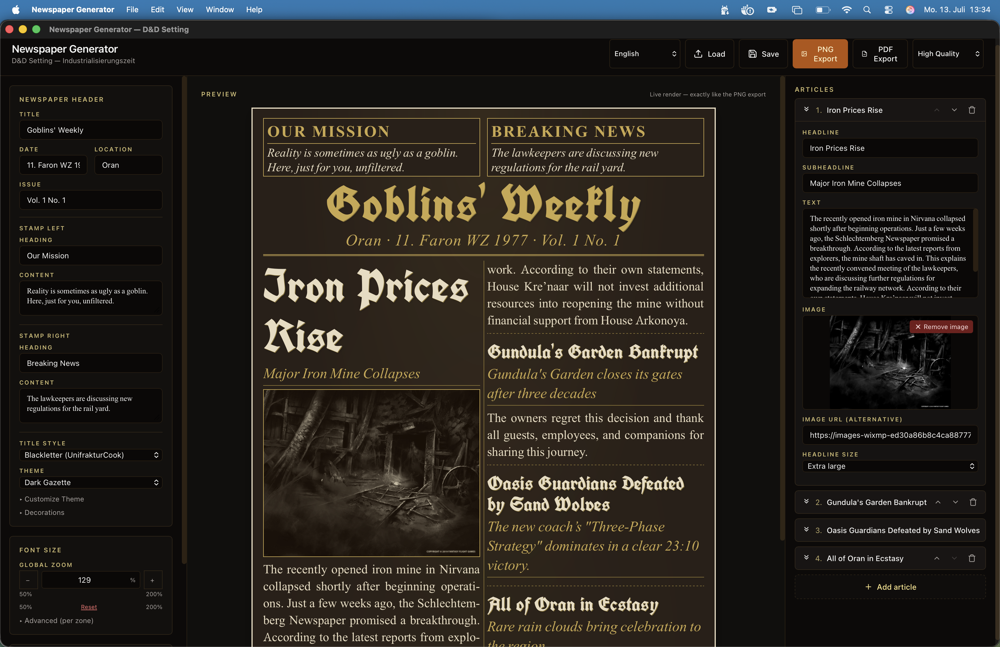
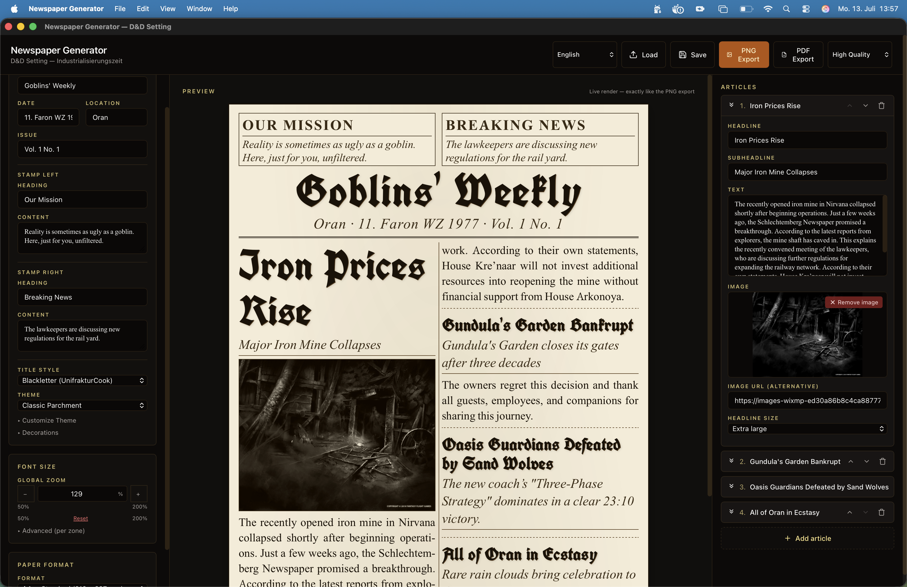

# Newspaper Generator

<p align="center">
  
  
</p>
<p align="center"><em>Six built-in themes: Classic Parchment, Dark Gazette, Royal Court, Elven Scroll, Dwarven Forge, Necromancer — plus a full theme customizer.</em></p>

A tool for creating historical newspaper articles for D&D campaigns — with live preview, JSON project files, and high-fidelity PNG/PDF export using real headless Chromium.

---

## ⚡ Install the Desktop App

The app is available for **Windows** and **macOS**. Pick your system below and follow the steps — no technical knowledge required.

> **Good to know:** The install scripts automatically install the runtime dependencies (Node.js and a headless browser) needed for PNG/PDF export. You don't have to install anything manually.

### 🪟 Windows

**Step 1: Open PowerShell**

- Press the **Windows key** on your keyboard (or click the Start icon in the bottom-left corner).
- Type **"PowerShell"**.
- Click on **"Windows PowerShell"** (or "Terminal" on Windows 11).

A black or blue window opens with a prompt like `PS C:\Users\YourName>`.

**Step 2: Paste the command and run it**

Copy the following line (select all, `Ctrl+C`):

```powershell
irm https://raw.githubusercontent.com/jderksen2504/Newspaper-Generator/main/desktop/scripts/install/install-windows.ps1 | iex
```

Click inside the PowerShell window, **right-click** to paste (or use `Ctrl+V`). Then press **Enter**.

**What happens:** The script downloads the latest app version, installs it (no admin rights required), then installs **Node.js** (if missing) and the **Playwright WebKit browser** (~80 MB, one-time download). Both are needed for PNG/PDF export. Total installation time: 2–5 minutes depending on your internet connection.

**Step 3: Launch the app**

After installation, you'll find **"Newspaper Generator"** in your Start menu. The script usually launches it automatically — if not, just click it in the Start menu.

**Updating to a new version:** Simply run the same command again. The old version is replaced automatically. Dependencies are only installed once (subsequent runs skip them if already present).

---

### 🍎 macOS

On macOS, installation is done via the Terminal — there's no way around this without an Apple Developer Account ($99/year), because macOS blocks every unsigned app downloaded from the internet. The install script handles everything automatically: download, installation to `/Applications`, removing the quarantine block, and installing the runtime dependencies (Node.js + Playwright browser) needed for PNG/PDF export.

**Step 1: Open the Terminal**

- Press **`Cmd + Space`** at the same time — this opens Spotlight search (a small window in the middle of the screen).
- Type **"Terminal"**.
- Press **Enter** (or click the first search result, "Terminal").

A window opens with a white or black background and a prompt like `YourName@Mac ~ %`.

**Step 2: Paste the command and run it**

Copy the following line (select all, `Cmd+C`):

```bash
curl -fsSL https://raw.githubusercontent.com/jderksen2504/Newspaper-Generator/main/desktop/scripts/install/install-macos.sh | bash
```

Click inside the Terminal window and press **`Cmd+V`** to paste. Then press **Enter**.

**What happens:** The script downloads the latest version, mounts the DMG, copies the app to `/Applications`, removes the quarantine attribute (`xattr -cr` — required without an Apple Developer Account), then installs **Node.js** (if missing — uses Homebrew if available, otherwise downloads the official installer and may prompt for your password) and the **Playwright WebKit browser** (~80 MB, one-time download). Total installation time: 2–5 minutes.

**Step 3: Launch the app**

From now on you'll find **"Newspaper Generator"** in Launchpad or under **Applications** in Finder. No further Terminal commands needed — everything was handled in Step 2.

**Updating to a new version:** Simply paste the same command into the Terminal again. The old version is replaced automatically. Dependencies are only installed once (subsequent runs skip them if already present).

---

### ⚠️ macOS: Why is the Terminal necessary?

Apple requires an **Apple Developer Account** ($99/year) for app signing. Without it, macOS marks every app downloaded from the internet with a "quarantine" attribute and blocks it on first launch with the message *"The app can't be opened because it is from an unidentified developer"*. The install script removes this attribute automatically — there's no way to do this via a simple installer download, which is why the Terminal is required.

---

### 🔄 Install a specific version

If you need an older version (e.g. for testing), append the version number:

**Windows (PowerShell):**
```powershell
& ([scriptblock]::Create((irm https://raw.githubusercontent.com/jderksen2504/Newspaper-Generator/main/desktop/scripts/install/install-windows.ps1))) v1.3.5
```

**macOS (Terminal):**
```bash
curl -fsSL https://raw.githubusercontent.com/jderksen2504/Newspaper-Generator/main/desktop/scripts/install/install-macos.sh | bash -s -- v1.3.5
```

Available versions: https://github.com/jderksen2504/Newspaper-Generator/releases

---

## 📦 Runtime Dependencies

The PNG/PDF export feature relies on a Node.js sidecar that launches a headless WebKit browser via Playwright. These are **not bundled in the app** (they would add ~200 MB to the installer) but are required for export to work.

| Dependency | Why needed | How it gets installed |
|------------|------------|----------------------|
| **Node.js 20+** | Runs the `export.js` sidecar that orchestrates the screenshot | Install scripts install it automatically (via Homebrew on macOS, via winget/MSI on Windows) |
| **Playwright WebKit browser** (~80 MB) | The actual headless browser that renders the newspaper page | Install scripts run `npx playwright install webkit` automatically |

If you install the app manually (without the install script — see [Manual Installation](#-manual-installation-without-the-install-script) below), you'll need to install these yourself:

```bash
# Install Node.js from https://nodejs.org/ (version 20 or newer)

# Then install the Playwright browser:
npx playwright install webkit
```

The app itself (editing, saving, loading JSON projects) works without these dependencies — only PNG/PDF export requires them.

---

## 📁 Repo Structure

```
newspaper-generator/
├── .github/workflows/build.yml    # GitHub Actions: builds macOS + Windows in parallel
├── README.md                       # This file
├── LICENSE
├── .gitignore
├── .nvmrc
│
├── src/                            # Next.js web app
├── src/app/
├── src/components/
├── src/lib/
├── package.json                    # Next.js dependencies
├── next.config.ts
├── tsconfig.json
├── ...                              # Next.js config files
│
└── desktop/                        # Tauri desktop app
    ├── src/                        # Tauri frontend (vanilla HTML/CSS/JS)
    ├── src-tauri/                  # Rust backend
    │   ├── src/                    # Rust code
    │   ├── sidecars/playwright-export/   # PNG renderer
    │   ├── capabilities/
    │   ├── Cargo.toml
    │   └── tauri.conf.json
    ├── scripts/                    # Build scripts (macOS, Windows, font download)
    ├── package.json                # Tauri dependencies
    └── vite.config.js
```

---

## 🏗️ Architecture

This repo contains **two apps** with the same feature set:

| App | Directory | Tech Stack | Use Case |
|-----|-----------|------------|----------|
| **Web App** | `/` (root) | Next.js 16 + TypeScript + Tailwind + Puppeteer | Browser preview, deploy to Vercel/Netlify/etc. |
| **Desktop App** | `/desktop/` | Tauri 2.0 (Rust) + Vanilla HTML/CSS/JS + Playwright | Native macOS/Windows app, GitHub Actions builds |

Both use **real Chromium** for PNG export (Puppeteer on web, Playwright on desktop) — this avoids the html2canvas pitfalls with `column-count`, `@font-face`, `filter`, and subpixel rounding.

---

## 🌐 Web App (Next.js)

### Run locally

```bash
npm install
npm run dev
# → http://localhost:3000
```

### Deploy

The web app is a standard Next.js app and can be deployed to Vercel, Netlify, etc.

**Important**: PNG export requires Puppeteer + real Chromium. On serverless platforms like Vercel/Netlify this doesn't work reliably — use a real server (Railway, Render, Fly.io, your own VM) or the desktop app for PNG export.

---

## 💻 Desktop App (Tauri) — for developers

### Build via GitHub Actions (recommended — no Mac/PC required)

1. Push the repo to GitHub
2. Go to **Actions** → **Build Desktop App** → **Run workflow**
3. Select which platforms to build (macOS/Windows)
4. Wait ~25–35 minutes (parallel on both platforms)
5. Download the artifacts:
   - `newspaper-generator-macos-universal` → `.dmg` (Universal Binary: Apple Silicon + Intel)
   - `newspaper-generator-windows-x64` → `.exe` (NSIS installer)

### Build locally

**macOS** (Universal Binary):
```bash
cd desktop
./scripts/build-macos.sh
```

**Windows** (PowerShell as admin):
```powershell
cd desktop
.\scripts\build-windows.ps1
```

### Publish a release

```bash
git tag v1.3.7
git push origin v1.3.7
```

This triggers the GitHub Actions workflow automatically, which builds both platforms and uploads all installers to a published release.

---

## 🔧 Manual Installation (without the install script)

Prefer to download and install manually instead of using the one-liner script? Here's how. Note that you'll also need to install the runtime dependencies yourself (see [Runtime Dependencies](#-runtime-dependencies) above).

### Windows

1. Open the [Releases page on GitHub](https://github.com/jderksen2504/Newspaper-Generator/releases/latest) in your browser.
2. Download the file `Newspaper.Generator_<version>_x64-setup.exe` (e.g. `Newspaper.Generator_1.3.6_x64-setup.exe`).
3. Double-click the downloaded `.exe` file. Windows may ask "Do you want to run this app anyway?" — click **"Run anyway"**.
4. The installer runs (takes ~10 seconds) and finishes.
5. You'll now find **"Newspaper Generator"** in your Start menu. Click it to launch the app.
6. **Install runtime dependencies** for PNG/PDF export (skip if already installed):
   - Install [Node.js 20+](https://nodejs.org/) (download the "LTS" installer and run it)
   - Open PowerShell and run: `npx playwright install webkit`

### macOS

1. Open the [Releases page on GitHub](https://github.com/jderksen2504/Newspaper-Generator/releases/latest) in your browser.
2. Download the file `Newspaper.Generator_<version>_universal.dmg` (e.g. `Newspaper.Generator_1.3.6_universal.dmg`).
3. Double-click the `.dmg` file. A window opens showing the app and an "Applications" folder icon.
4. Drag the **"Newspaper Generator"** app onto the **"Applications"** folder.
5. **Remove the quarantine attribute** (required because the app is not signed by Apple):
   - Open Terminal (press `Cmd + Space`, type "Terminal", press Enter)
   - Paste this command and press Enter:
     ```bash
     xattr -cr "/Applications/Newspaper Generator.app"
     ```
   - No output appears — that's normal. The app will now launch without warnings.
6. **Install runtime dependencies** for PNG/PDF export (skip if already installed):
   - Install [Node.js 20+](https://nodejs.org/) (download the macOS installer and run it)
   - In Terminal, run: `npx playwright install webkit`

---

## 🚀 Quick setup: Push to GitHub

```bash
# In the repo root
git init
git add .
git commit -m "feat: initial release of Newspaper Generator"
git branch -M main
git remote add origin git@github.com:YOUR_NAME/newspaper-generator.git
git push -u origin main
```

After that, the GitHub Actions workflow is visible in the Actions tab.

---

## 📦 Features

- **Live preview** with Fraktur / Blackletter / Serif / Italic fonts
- **Per-zone font sizes** (stamp, title, meta, article headline / sub / body) + global zoom
- **PNG export** via real headless Chromium (near-identical to the preview)
- **PDF export** with selectable compression (lossless / high / medium / low)
- **JSON save/load** for projects
- **Paper formats**: A5, A4, A3, Letter, Tabloid, Broadsheet
- **Column layout** (2–6 columns) with `column-fill: auto`
- **6 themes** (Classic, Dark Gazette, Royal Court, Elven Scroll, Dwarven Forge, Necromancer)
- **Theme customizer** with 14 color pickers — save your own color schemes
- **SVG duotone image filter** — images are tinted with the theme colors (light-dark instead of black-and-white)
- **Decorations**: corner ornaments, divider styles (simple / double / runes / dashed), title shadow
- **Self-hosted web fonts** (offline-capable, CSP-compliant)
- **Auto-migration** of old JSON files (fontSizePt → fontSizes + zoom)
- **i18n** German / English

---

## 🛠️ Technical details

### Why real Chromium instead of html2canvas?

`html2canvas` reconstructs the DOM onto a `<canvas>` and struggles with:
- `column-count` (column layout)
- `@font-face` (web fonts, especially Fraktur)
- `filter: grayscale()` (image filters)
- Subpixel rounding

Puppeteer/Playwright use **real Chromium** with the same layout engine as the preview. The result is very close to the preview, though minor subpixel differences may occur.

### Desktop app prerequisites (for developers)

| Tool | Version | Purpose |
|------|---------|---------|
| Rust | ≥ 1.77 | Tauri backend |
| Node.js | ≥ 20 | Frontend build + Playwright sidecar |
| Python | ≥ 3.11 | Icon generation (Pillow) |

**macOS**: Xcode Command Line Tools (`xcode-select --install`)
**Windows**: Microsoft C++ Build Tools + WebView2 Runtime (preinstalled on Win11)

### Code signing

Unsigned apps are blocked by macOS on first launch. For personal use this isn't a problem — the install script removes the quarantine attribute automatically. For distribution to others without requiring Terminal usage, an Apple Developer Account ($99/year) + code signing would be required. See `desktop/README.md` for details.

---

## 📝 License

GPL v3 — see `LICENSE`. Derivative works must remain free and open-source under the same license. Fonts under SIL Open Font License.
